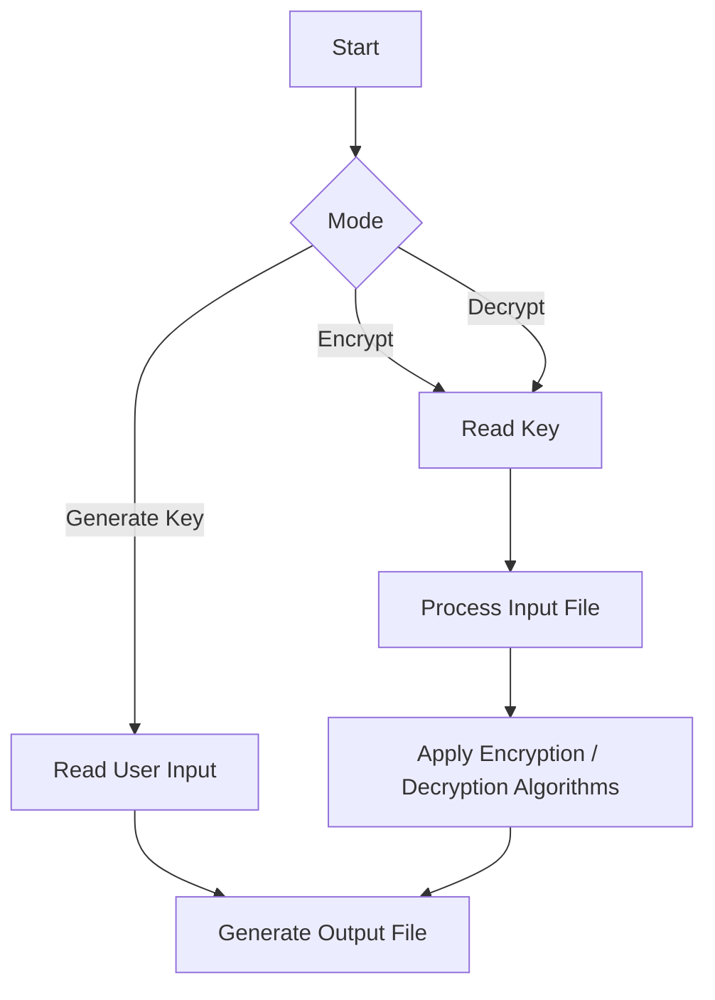

# security-final-project

This project uses a variety of encryption techniques in combination to provide encryption and decryption of files.

Flowchart Diagram

```mermaid
flowchart TB
A[Start] --> B{Mode}
B -->|Encrypt| C[Read Key]
B -->|Decrypt| C
B -->|Generate Key| D[Read User Input]
C --> E[Process Input File]
E --> F[Apply Encryption / Decryption Algorithms]
D --> G[Generate Output File]
F --> G
```