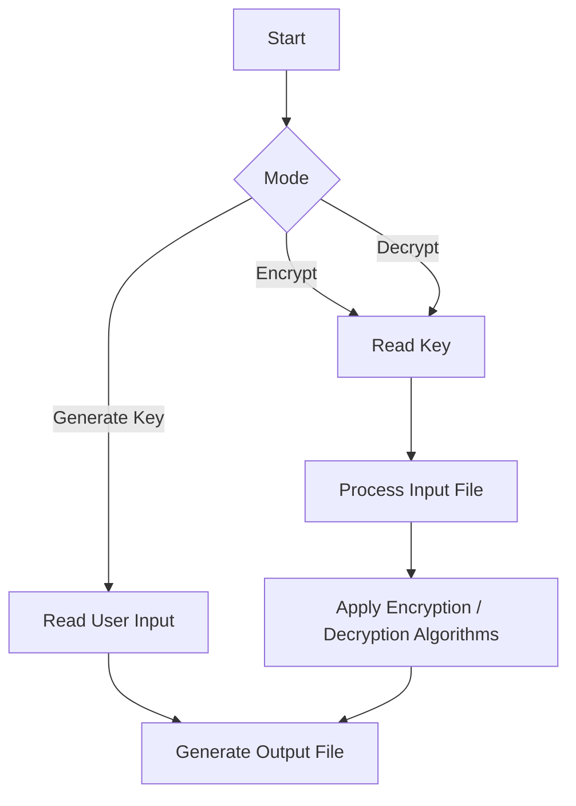
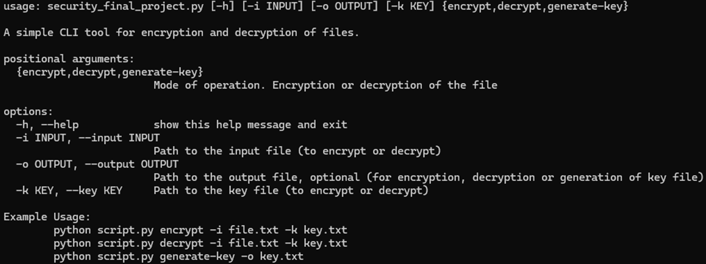

# Security Final Project

This project uses a variety of encryption techniques in combination to provide encryption and decryption of files.

Users can choose from classical methods like Caesar cipher, sequence reversal, and Vigenère cipher to encrypt their messages. Transformations are applied in the sequence specified in a key file, which can be generated using the program itself. The program also supports decryption to restore the original message.

# Flowchart Diagram



# Usage
```bash
# Clone the repository
git clone https://github.com/NaBrHCl/security-final-project.git

# Navigate to the project directory
cd security-final-project

# Run program via python
python security_final_project.py -h
```
